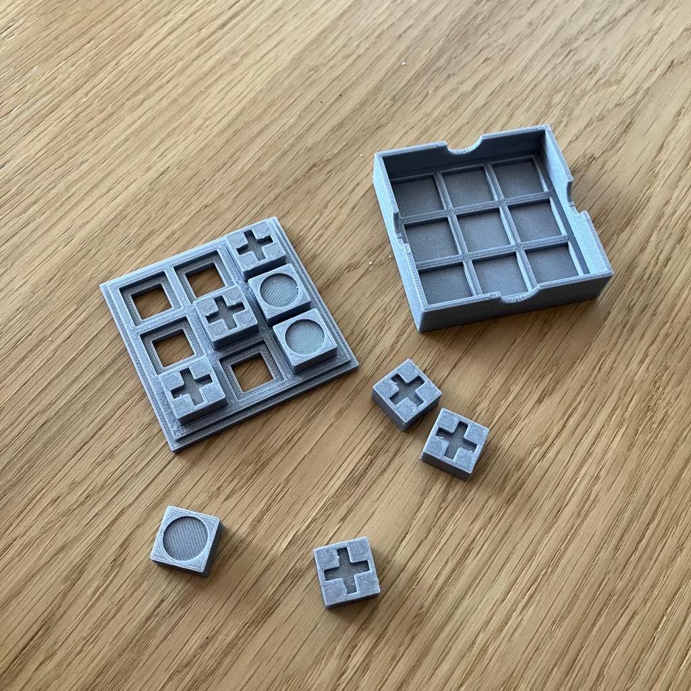
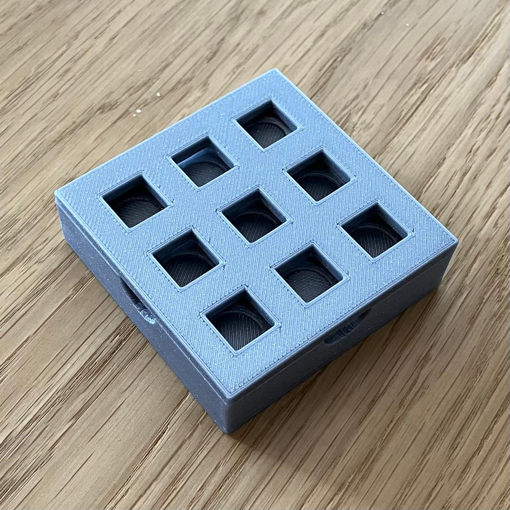

[![CC BY-NC-SA 4.0][cc-by-nc-sa-shield]][cc-by-nc-sa]

The popular Tic-Tac-Toe game. The detachable lid allows it to be easily carried, and the small size will make it fit in any pocket.
The set consists of a game board (3 by 3 fields), a lid and 9 pawns. The pawns have a cut circle on one side and a cross on the other, which allows them to perform a double function. The shapes are very easy to feel.

## License

This work is licensed under a [Creative Commons Attribution-NonCommercial-ShareAlike 4.0
International License][cc-by-nc-sa].

[![CC BY-NC-SA 4.0][cc-by-nc-sa-image]][cc-by-nc-sa]

[cc-by-nc-sa]: http://creativecommons.org/licenses/by-nc-sa/4.0/
[cc-by-nc-sa-image]: https://licensebuttons.net/l/by-nc-sa/4.0/88x31.png
[cc-by-nc-sa-shield]: https://img.shields.io/badge/License-CC%20BY--NC--SA%204.0-lightgrey.svg